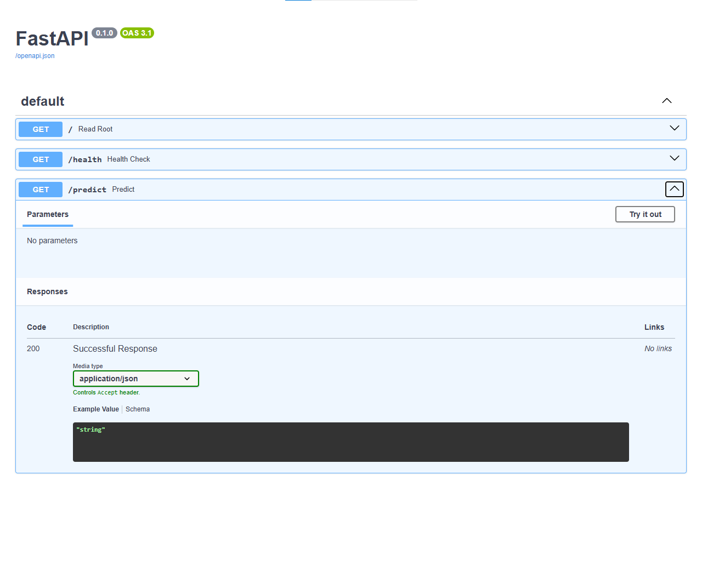

# FastAPI MLOps Demo 🚀

A RESTful API built with FastAPI for serving machine learning predictions. This project demonstrates MLOps best practices including API design, interactive documentation, and production-ready endpoints.

## 🌟 Features

- **Health Check Endpoint** - Monitor API status for production deployment
- **Prediction Endpoint** - Ready for ML model integration
- **Auto-Generated Documentation** - Interactive Swagger UI at `/docs`
- **Fast & Async** - Built with FastAPI for high performance
- **Type Safety** - Full Python type hints for better code quality

## 🛠️ Tech Stack

- **Python 3.10**
- **FastAPI** - Modern web framework for building APIs
- **Uvicorn** - Lightning-fast ASGI server
- **Pydantic** - Data validation using Python type annotations

## 📋 Prerequisites

- Python 3.10+
- Conda (recommended) or pip

## 🚀 Installation & Setup

### 1. Clone the repository
```bash
git clone https://github.com/mnzirain/fastapi-mlops-demo.git
cd fastapi-mlops-demo
```

### 2. Create and activate environment
```bash
conda create -n mlops python=3.10 -y
conda activate mlops
```

### 3. Install dependencies
```bash
pip install fastapi uvicorn
```

### 4. Run the application
```bash
uvicorn main:app --reload
```

The API will be available at: `http://localhost:8000`

## 📚 API Endpoints

| Method | Endpoint | Description |
|--------|----------|-------------|
| GET | `/` | Root endpoint - Returns welcome message |
| GET | `/health` | Health check - Returns API status |
| GET | `/predict` | Prediction endpoint - Ready for ML model integration |

## 📖 Interactive Documentation

FastAPI automatically generates interactive API documentation:

- **Swagger UI**: http://localhost:8000/docs
- **ReDoc**: http://localhost:8000/redoc

## 🔮 Future Enhancements

- [ ] Integrate trained ML model for predictions
- [ ] Add request/response validation with Pydantic models
- [ ] Implement logging and monitoring
- [ ] Add unit tests with pytest
- [ ] Containerize with Docker
- [ ] Deploy to cloud platform (AWS/GCP/Azure)

## 📸 Screenshots

### Swagger UI



*Interactive API documentation with try-it-out functionality*

## 🤝 Contributing

Contributions are welcome! Feel free to open issues or submit pull requests.

## 📝 License

This project is open source and available under the MIT License.

## 👤 Author

**Mike Nzirainengwe**
- GitHub: [@mnzirain](https://github.com/mnzirain)
- LinkedIn: [linkedin.com/in/mike-n-48a56354/] (https://www.linkedin.com/in/mike-n-48a56354)

---

⭐ If you found this project helpful, please give it a star!